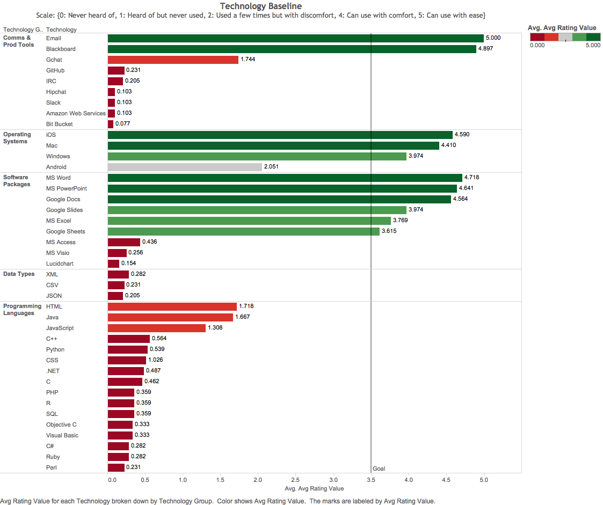
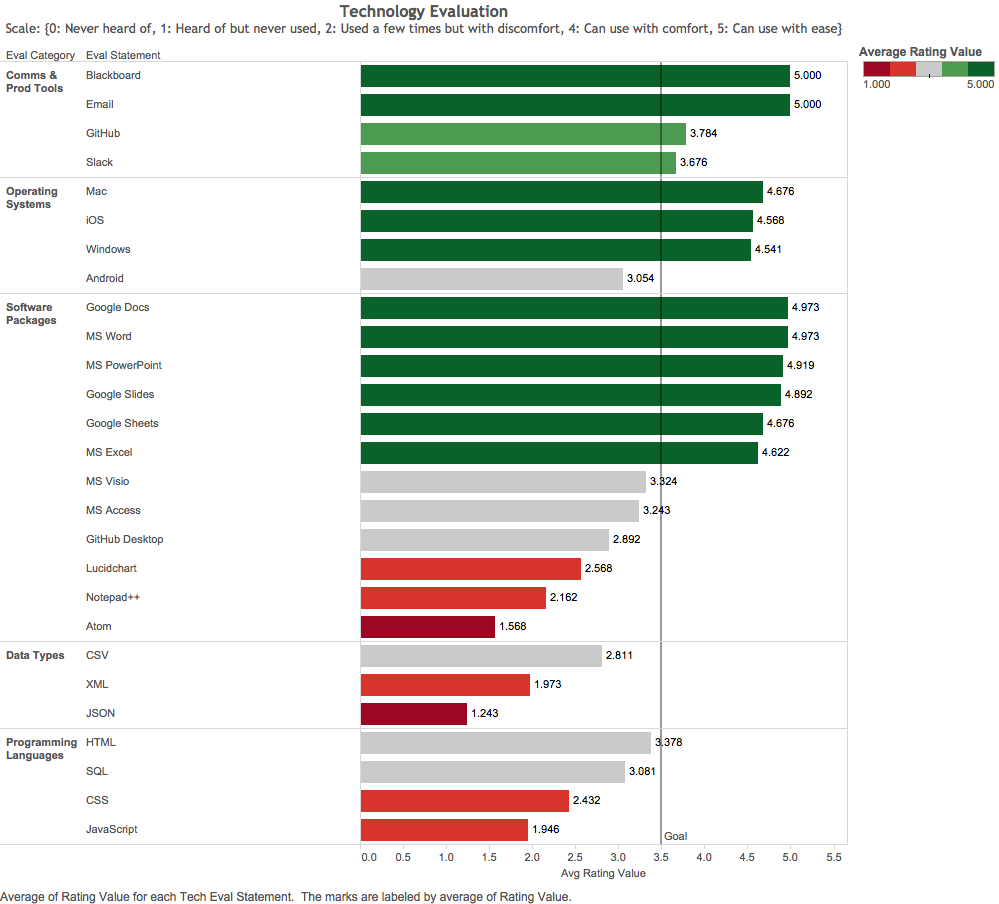
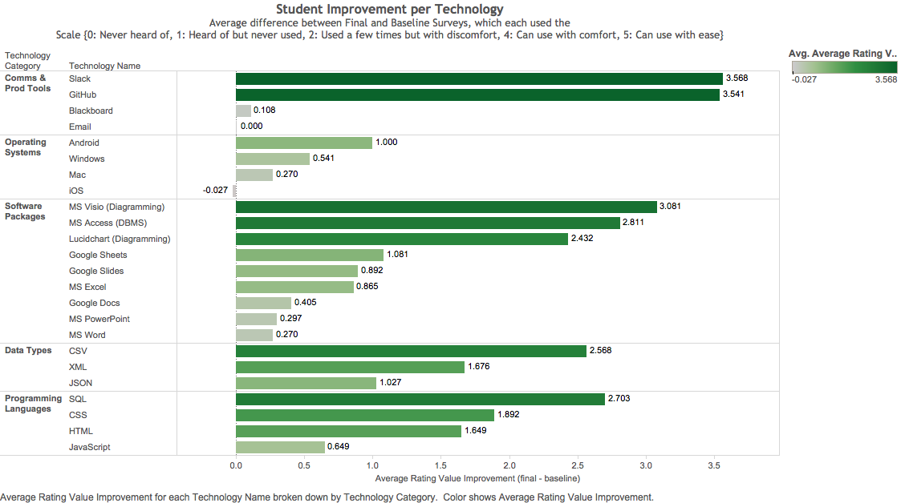
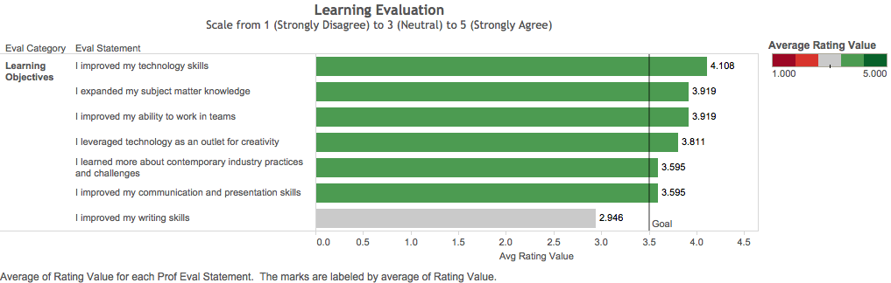
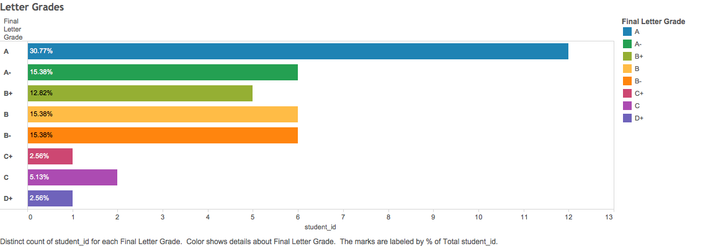
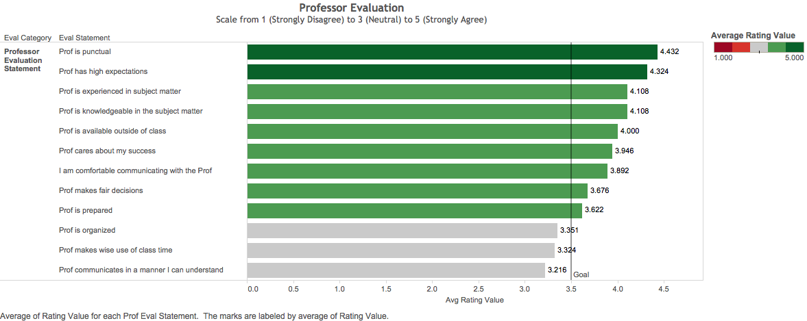
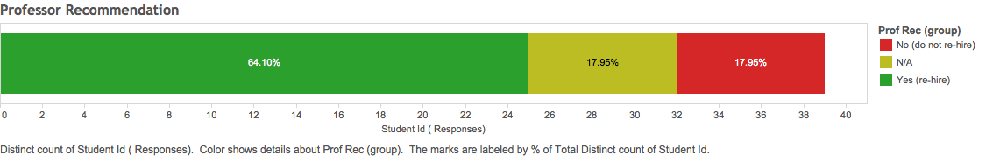
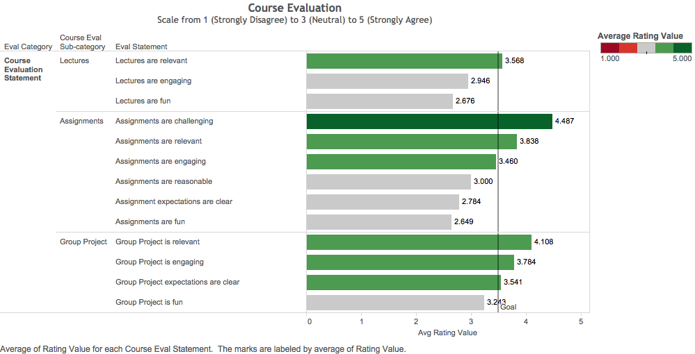

# Post Mortem Report

## Results

### Student Learning

Student learning was measured by both surveys and grades.

#### Baseline Survey

On the first day of class, students took a baseline technology comfort survey.

It revealed a strong foundation in documents, presentation, and spreadsheet software, as well as opportunities to learn diagramming software, database management software, and programming languages.

#### Exit Survey

On the last day of class, students responded to an exit survey which included a follow-up section on technology comfort levels.

The follow-up revealed moderate levels of comfort in technology categories where previously there had been little or none. This is primarily the case with diagramming software, database management software, text editors, and web development languages.

The greatest gains came in technologies with which the students had a low baseline comfort (e.g. GitHub, Slack, MS Access, diagramming tools, SQL, CSS, HTML), however students also made modest gains with spreadsheet software with which they had indicated prior familiarity.

These technology skill improvements were confirmed by students when they indicated in the exit survey the degree to which they thought they had met their learning objectives.

On average, students said they improved most in learning technology skills, subject matter knowledge, and the ability to work in teams, while on average they said they did not improve their writing skills.

#### Final Grades

This student learning and performance was reflected by their final letter grades, where 35 out of 39 (~90%) earned an A or B. On average, students earned a B+, with a mean final grade of 87.92 and a median of 89.69.

### Instructor Performance

Just as the professor evaluated student learning, students also evaluated the professor.

While they gave the professor high marks for subject matter knowledge and experience, and the degree to which they could relate and communicate with the professor, they indicated an opportunity to improve general organization and clarity.

Ultimately, 25 out of 39 students (64%) recommended the professor for teaching this course in future semesters, while 7 out of 39 (17%) did not.

### Course Administration

When given an opportunity to give feedback on the course itself, students highlighted several areas of improvement.

Most notably, they reported a relative general lack of fun and engagement. They also indicated an opportunity to improve clarity of assignment expectations.
