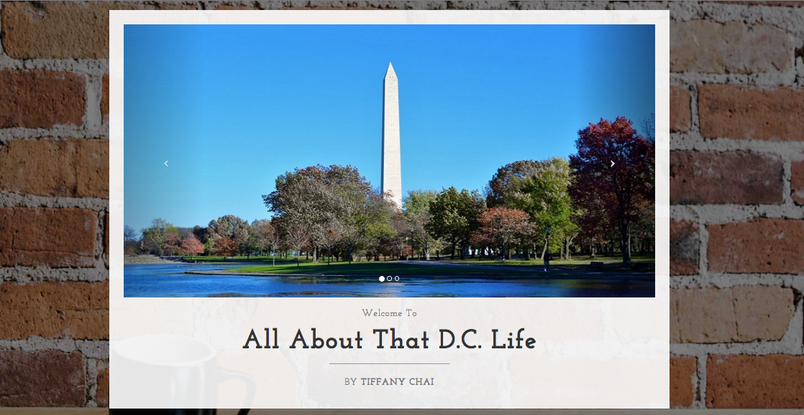

# Student Website Showcase

## Gold Awards

### [*All About that D.C. Life*](http://tiffanychai1996.github.io/)

[source code](https://github.com/tiffanychai1996/tiffanychai1996.github.io)

 

### [*Brandon's Site*](http://wendtb.github.io/student-site/)

[source code](https://github.com/wendtb/student-site)

### [*Cassidy's Site*](http://sheacassidy6.github.io/sheacassidy6.github.io/)

[source code](https://github.com/sheacassidy6/sheacassidy6.github.io)

### [*Elliot's Site*](http://eliskin.github.io/)

[source code](https://github.com/eliskin/eliskin.github.io)

### [*Events by Becca*](http://rebeccabarth.github.io/Archive-2/)

[source code](https://github.com/rebeccabarth/Archive-2)

### [*Isabel Strachan Photography*](http://istrachan.github.io/)

[source code](https://github.com/istrachan/istrachan.github.io)

### [*India's Magnificent Ponies*](http://india9152.github.io/indiasmagnificentminiatureponies/)

[source code](https://github.com/istrachan/istrachan.github.io)

## Silver Awards

website_title | source_code
--- | ---
[*Addison's Site*](http://amholmes1.github.io/my_site/)	| [source code](https://github.com/amholmes1/my_site/tree/gh-pages)
[*Adopt a Pet*](http://zfiore.github.io/Personal_Website/) | [source code](https://github.com/zfiore/Personal_Website)
[*Ananya's Site*](http://anku321.github.io/mysite)	| [source code](https://github.com/anku321/mysite/tree/gh-pages)
[*Daniel's Site*](http://danielgub.github.io/danielgub.github.io/)	| [source code](https://github.com/DanielGub/danielgub.github.io)
[*Robert's Site*](http://rwinther.github.io/website/)	| [source code](https://github.com/rwinther/website)
[*Ryan's Site*](http://ryanlasker.github.io/mysite)	| [source code](https://github.com/ryanlasker/mysite)
